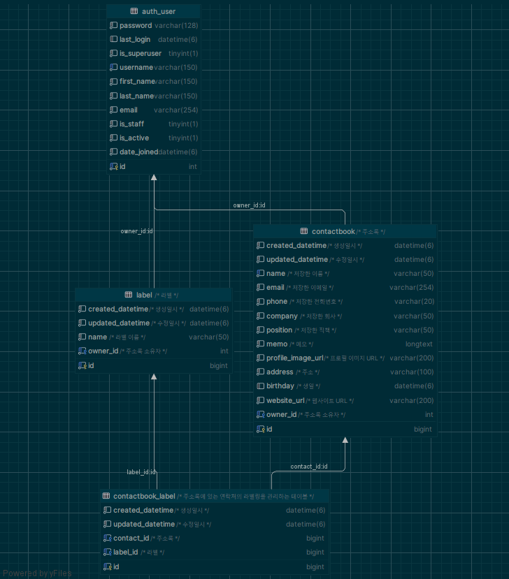

# contactbook
구글 주소록을 참고하여 만든 주소록 Rest API

## 기능 요구 사항
- 주소록
  - 목록
    - 목록에 출력될 필드는 다음과 같습니다.
      - 프로필 사진
      - 이름
      - 이메일
      - 전화번호
      - 회사 (직책)
      - 라벨
    - 정렬
      - 기본 출력은 등록 순서대로 정렬합니다.
      - 이름, 이메일, 전화번호 중 하나를 선택하여 정렬할 수 있습니다.
      - 정렬은 오름차순/내림차순/해제 순입니다.
    - 페이징
      - 스크롤 페이징 처리가 되도록합니다.
  - 연락처 (상세보기/입력)
    - 입/출력 필드는 다음과 같습니다.
      - 프로필 사진 : url 입력 방식
      - 이름
      - 이메일
      - 전화번호
      - 회사
      - 직책
      - 메모
      - 라벨
        - 사용자 정의 라벨
        - 연락처 1개에 라벨 다수 연결 가능
      - 기타 항목 추가
        - 주소
        - 생일
        - 웹사이트


## 개발 환경

- Python 3.11
- Django 4.2 
- djangorestframework 3.12.4
- MySQL 8.2

## Database Modeling



### contactbook(주소록)

- 연락처 정보를 저장하는 주소록 테이블
- owner: User 모델과 1:N 관계이고 해당 주소록의 소유자를 나타낸다.
- label: 연락처 정보를 라벨링하는 테이블과 N:M 관계이다. ManyToManyField로 연결되어 있으며, through를 통해 중간 테이블을 생성한다.

### label(라벨)

- 연락처 정보를 라벨링하는 테이블

### contactbook_label(주소록 라벨)

- 주소록과 라벨 테이블의 중개 테이블
- 주소록과 라벨의 N:M 관계를 나타낸다.

## 최적화 

### 쿼리 최적화

1. 주소록(contactbook) 쿼리 조회시 `prefetch_related`를 사용하여 연관된 라벨(label) 정보를 미리 조회한다.
2. pagination을 사용하여 한번에 가져올 데이터의 양을 제한한다.
3. `bulk_create`를 사용하여 여러개의 데이터를 한번에 생성한다.

```python
# backend/apps/contactbook/service.py
class ContactBookService:
    @staticmethod
    def add_label(instance, labels: list[int], bulk=False):
        exist_labels = (
            Label.objects.owner(instance.owner)
            .filter(id__in=labels)
            .values_list("id", flat=True)
        )
        already_labels = instance.labels.values_list("id", flat=True)
        add_labels = set(exist_labels) - set(already_labels)
        add_items = [
            ContactLabel(contact=instance, label_id=label_id)
            for label_id in add_labels
        ]
        if add_items:
            ContactLabel.objects.bulk_create(add_items)
            instance.refresh_from_db()
```